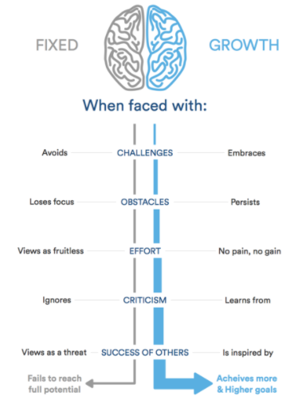

# GROTH MINDSET
***
A growth mindset is believing that one's abilities can be developed through perseverance and effort. Its like love of learning .
***
**There are tow types of mindsite:** 

* Fixed minset
* Growth minset
*** 
And here the picture explain the difference between them:

So we can say : 
***
people with a fixed mindset believe that abilities are inborn , it means they are unchangeable . But people with growth mindset believe that abilities can be developed.
***
### How can we develop our growth mindset :
1. Challenges
2. Obstacles
3. Effort
4. Criticism
5. Success of others

